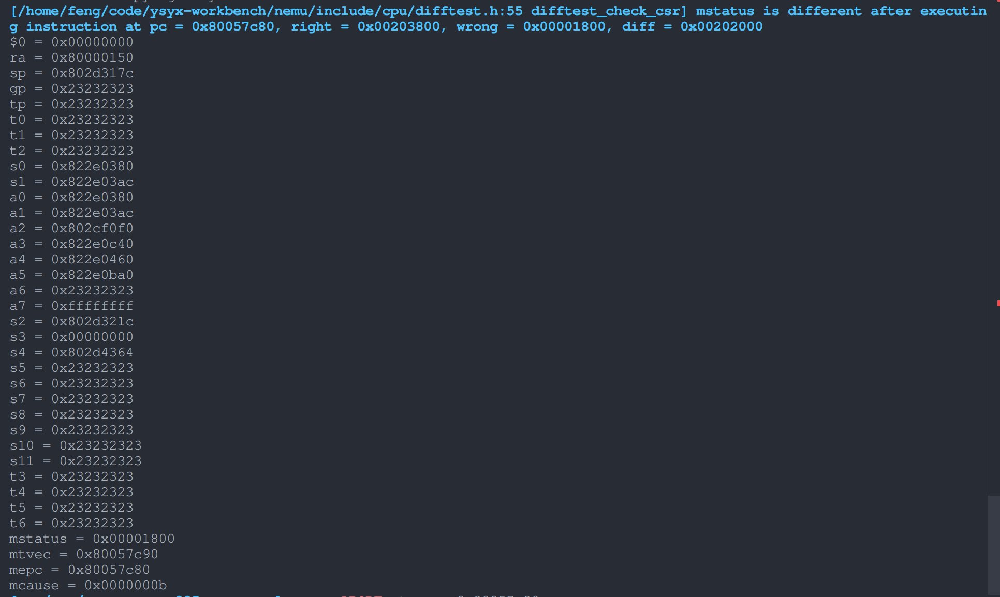
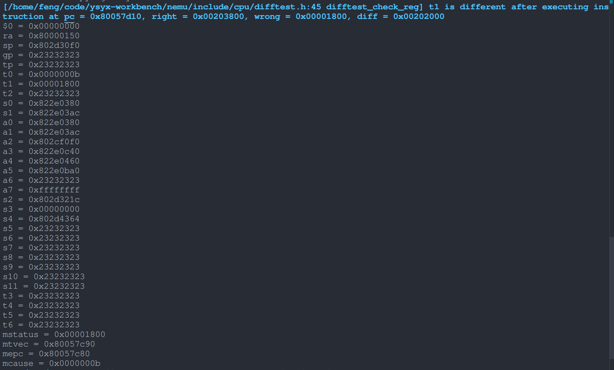

---  
marp: true
---  

# nemu启动rt-thread时difftest报错  

---

我已经将spike-diff配置成只支持M态  

nemu在启动rt-thread时，在执行完ecall指令之后，difftest报了如下错误:  

  

---  

在查完特权级手册后，发现是`mstatus`的`TW`和`FS`字段不一样，但是即便是在了解了这两个字段的意义之后，我依旧不知道为什么这两个字段会被修改，于是我便在difftest时跳过检查`mstatus`这个寄存器  

---

然后又发生了如下错误：  

  

---

故技重施，我又跳过了`t1`寄存器的检查  

结果difftest就通过了  

我现在能推测出来的是，这也许是个不太大的问题，因为这两个寄存器的错误没有传播到状态机的其他寄存器上，但我依旧不知道为什么那两个字段会被改写  