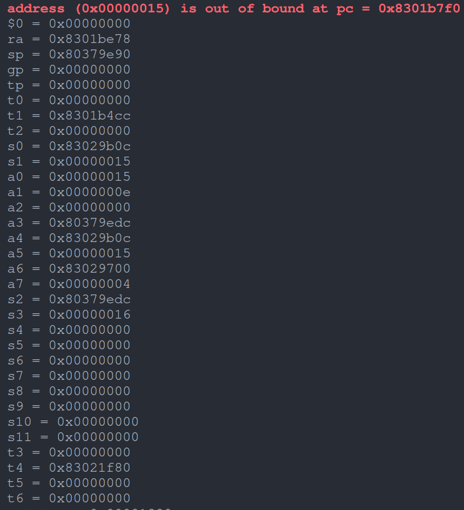
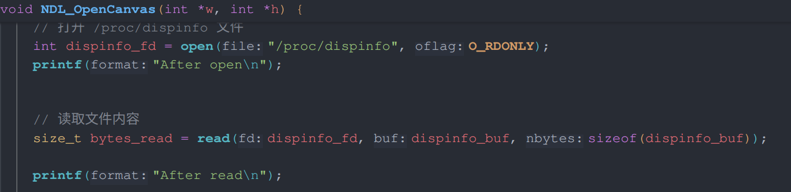
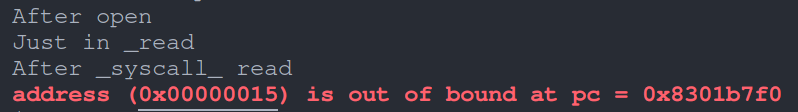
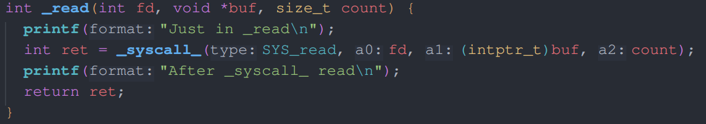

---  
marp: true
---  

# PA 3.3 访存越界  

---  

在完成 PA 3.3的时候，出现了访存越界的现象，整个调试过程中difftest都是开着的：  

  

---  

通过print调试法最终确定在 `NDL_OpenCanvas` 函数中:  

  
  

---  

然后继续跟到 `read` 系统调用中，发现read应该是正常返回的：  

  
  

---  

这就很奇怪了，如果C库是正确的，那就应该回到`NDL_OpenCanvas` 函数中，但是并没有  

接下来应该怎么调试？

