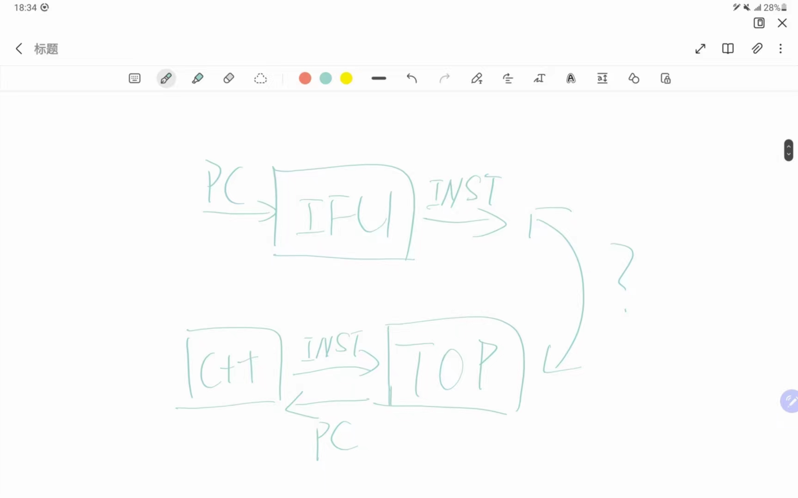

---  
marp: true
---  
  
# 组会报告  
  
报告人：张凌豪  
学号：ysyx_23060337  

---  

## 学习进度  

### 已完成  

1. 支持RV32IM的NEMU（PA2.1）  

### 进行中  

1. 运行时环境和基础设施（PA2.2）  
2. 用RTL实现最简单的处理器  

---  

## 遇到的的困难  

1. 被处理器设计卡了一段时间，疏理不出完整的思路，下面是问题之一： 

---  

  

---  

