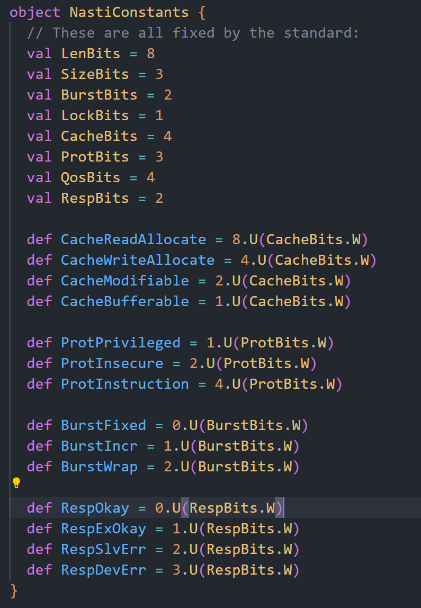

  
# 组会报告  
  
报告人：张凌豪  
学号：ysyx_23060337  

---  

## 学习进度  

---  

### 已完成  

1. 实现通过批处理模式运行NEMU  
2. 实现字符串处理函数、实现sprintf  
3. 实现iringbuf、itrace、ftrace（尚未优化完tail优化）
4. 学习 Chisel 并用 Chisel 完成预学习数电实验  

### 进行中  

1. 学习 Chisel、Scala 的语法特性，高级用法  
2. 用RTL实现最简单的处理器  
3. 支持RV32E的单周期NPC  

---  

## 遇到的的困难  

---  

1. NEMU 中的 宏  

---  

2. Chisel 中 def 和 val 的 区别  

---  

  
我不明白为什么这里一部分用val，另一部分用def，以下是ChatGPT给出的解释  
- val:
在定义时求值，并在整个对象生命周期内保持不变。
在硬件描述中，如果用 val 来定义一个硬件对象，如 UInt，那么这个对象在整个生命周期内都是相同的实例。
- def:
每次调用时都会重新求值。
在硬件描述中，每次调用 def 方法时都会生成一个新的硬件对象实例。

---  

但是依旧不解决问题，因为这里的def都是是常量，所以我认为这里完全可以用val来代替，我唯一能想到的是如果用 def ，那么后面可以用 override 关键字进行重写，但是整个 riscv-mini 工程中并没有对这些值进行重写  

还有就是我注意到只要不是明确的给出字面值，riscv-mini 都会将常量用 def 来定义（不确定） 

为什么要这样处理，目的是什么？   

---  

  

类`AluSimple`继承了`Alu`，但是没有显式地实现`width`方法，只有一个同名的构造参数  

这就很奇怪，为什么`val`在这里起到一个实现了抽象成员函数的作用  

---  

3. 处理器设计没思路  

---  
