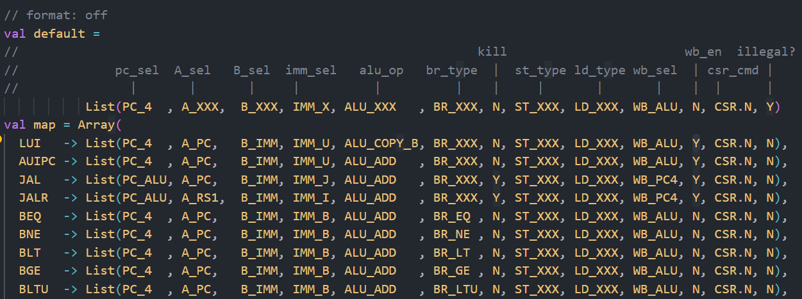
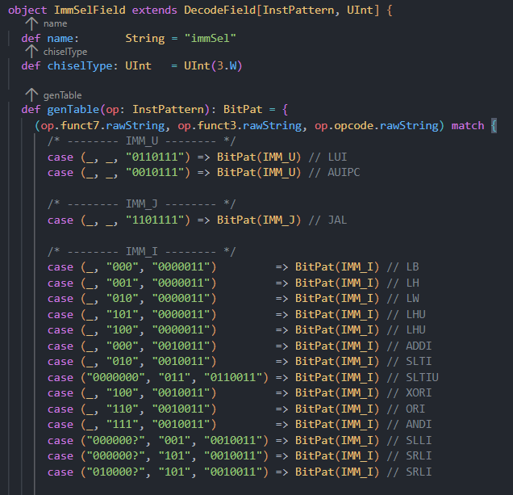
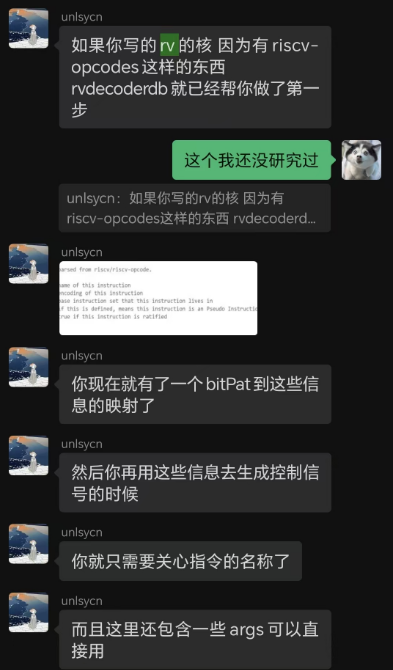
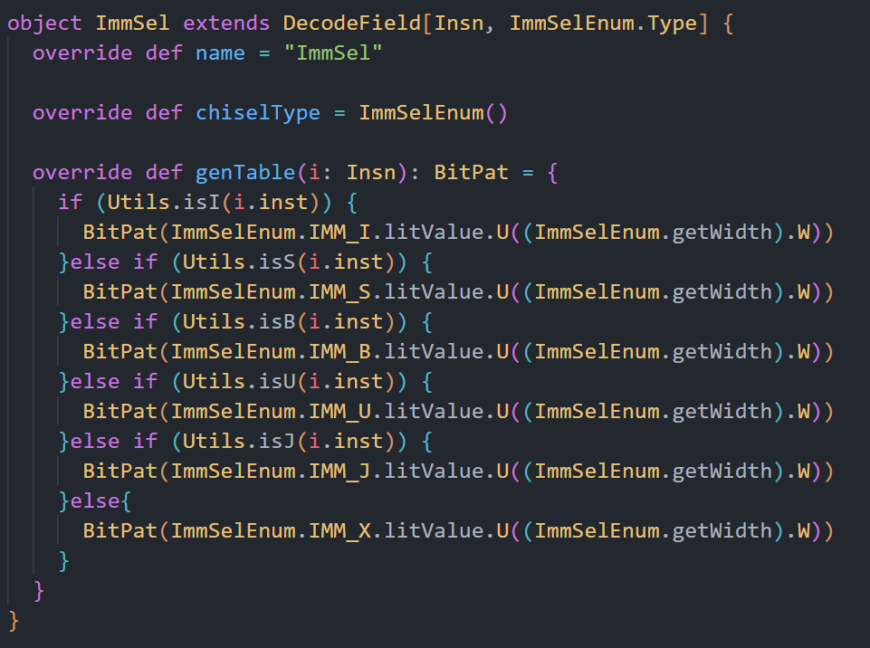
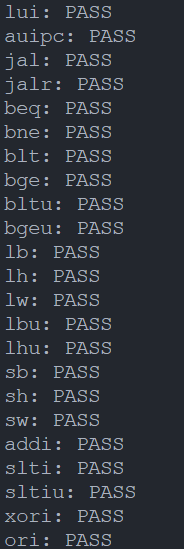
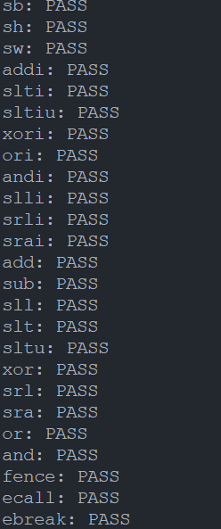

  
# 组会报告  
  
报告人：张凌豪  
学号：ysyx_23060337  

---  

## 学习进度  

---  

### 已完成  

1. 完整实现ftrace（考虑tail） 
2. 学习 rvdecoderdb 的使用方法，并尝试接入单周期处理器的 Decode 模块  
3. 为 Decode 模块 编写测试   

### 进行中  

1. 实现单周期处理器

---  

## 遇到的的困难  

在实现单周期处理器的控制信号生成模块的时候花了很多时间，历经几次迭代  

---  

### 第一版 Decode  

  

---  

#### 带来的问题  

1. 逐行匹配遍历查找，性能较差  
2. 在增加指令或者要重构生成的信号的时候难以维护  

---  

### 第二版 Decode  

后来从王锐同学的双周分享会中了解到 Chisel 中有个东西叫做 DecoderTable，搭配 espresso 可以生成 面积小、性能高且可维护性高的电路，于是就照葫芦画瓢写了起来    

---  

  

---  

#### 带来的问题  

1. 没有使用充分发挥 Scala 语言的能力，不懂得通过为其添加 Attribute 来模块化映射信息 ，导致依旧难以维护

---  

### 第三版 Decode  

后来在Chisel交流群中请教了一下，了解到了 rvdecoderdb  

  

---  

  

---  

#### 通过所有测试

  

 

---  

#### 途中遇到的问题  

1. 看不懂 rvdecoderdb 的源代码，恶补 Scala 语法知识  
2. 误把 rvdecoderdb 当成是一个库，不停的找它的 “release”  
3. 。。。。  

---  

