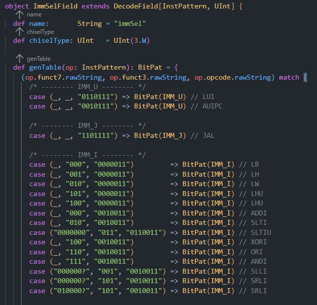

  
# Getting Started with Chisel rvdecoderdb  

Linghao Zhang, YSYX_23060337  
*Group Meeting on Sun, 5 Oct 2024*

---  

## 一些说在前面的话。。。  

**rvdecoderdb** 算是 **Chisel Decoder** 的一个附属品，所以本次分享的前提是你已经学会了 **Decoder** 的基本使用方法，具体可以参考王锐同学的b站双周会分享视频  
[https://www.bilibili.com/video/BV1Ef421d78w/?spm_id_from=333.788&vd_source=c5f2a2773d02bf2b81c008b900c8461b](https://www.bilibili.com/video/BV1Ef421d78w/?spm_id_from=333.788&vd_source=c5f2a2773d02bf2b81c008b900c8461b)  

PS：第一次做分享，如果有哪里不懂的或者是没讲清楚的，请随时打断我（feel free）

---  

## 学习资源  
**rvdecoderdb** 官方仓库  
[https://github.com/chipsalliance/rvdecoderdb](https://github.com/chipsalliance/rvdecoderdb)  
**riscv-opcodes** 官方仓库  
[https://github.com/riscv/riscv-opcode](https://github.com/riscv/riscv-opcodes)  
**rvdecoderdb** 的一个使用 **demo**
[https://github.com/arch-simulator-sig/chisel-env](https://github.com/arch-simulator-sig/chisel-env)  
**T1 Decoder**  
[https://github.com/chipsalliance/t1/tree/master/t1/src/decoder/attribute](https://github.com/chipsalliance/t1/tree/master/t1/src/decoder/attribute)  

---  

## 用一个例子来引入今天的主题：
尝试向 **Decoder** 描述 **ImmSel** 字段的解码规则  

---  

假设你在看完上面推荐的视频之后开始照葫芦画瓢，那你的代码大概率会长这样。。。  

  

---  

## 难以接受。。。  

这样的代码是不利于维护的：  

1. 首先可以预测到的是，未来如果我们希望让我们的 **Decoder** 支撑更多的指令，那我们必须增量化地为这个 **Field** 添加更多规则  
2. 代码难以阅读，如果去掉注释，其他人难以看懂每条规则在描述什么  

---  

## 为什么会这样？  

原因就在于我们的 **InstructionPattern** 里所携带的信息过于单薄  

  

可以看到在这个 **InstructionPattern** 中，我们基本上只描述了每条指令的基本格式是什么样子的，这就使得我们在向  **Decoder**  去描述解码规则时，我们的可用信息很少  

就像一个人的特点如果只有他的名字的时候，那他总是会在自我介绍的时候词穷  

---  

## 改进方法：添加字段  

让我们给 **InstructionPattern** 添加更多字段来辅助我们描述解码规则，作为演示，这里我向 **InstructionPattern** 中添加一个 **Type** 字段：  

  

---  

接着在输入 **InstructionPattern** 的时候携带这一信息：  

  

---  

此时描述 **ImmSel** 这个字段就简单很多了，我们可以直接通过 **Type** 来判断立即数类型：  

  

---  


这样就解决了刚才提到的两个问题  

1. 未来如果我们希望让我们的 **Decoder** 支撑更多的指令，我们只需改动少量代码，很多时候甚至不需要改！  
2. 代码可读性更好  
---  

## 这样就结束了吗？  

有了上面这个示例，添加字段便是一个很自然的需求

随之而来的问题就是：我们需要维护大量指令的大量字段信息：复杂度 O(n * m)

  

---  

要解决这个问题，就要请出今天的主角：**rvdecoderdb**  

---  

## rvdecoderdb 有什么用？  

简单来说，**rvdecoderdb** 就是一个解析器，它通过解析 **riscv-opcodes** 仓库下的所有文件中指令所携带的指令信息来生成一个个包含各种信息字段的 **Instruction** 指令对象  

---  


我们可以先简单看看[riscv-opcodes](https://github.com/riscv/riscv-opcodes)这个仓库里都有些什么东西  

---  

所以我们可以看到，**riscv-opcodes** 这个仓库描述了所有 **RISC-V** 指令的几乎所有特征，那此时如果有一个解析器可以解析这个库中的信息并将其反序列化成一个个指令对象，再将这些指令对象输入到我们的 **InstructionPattern** 中（继承、构造器...），我们就可以利用起这些信息了  

而这正是 **rvdecoderdb** 所做的！

---  

再来看一下  **Instruction**  对象长啥样  

---  

所以整个流程大致如下图所示：  

  

---  

## 使用方法

---  

1. 先将  **rvdecoderdb**  拉取到本地，并拉取它的子模块 **riscv-opcodes**  

```shell  
git clone git@github.com:chipsalliance/rvdecoderdb.git  
cd rvdecoderdb/  
git submodule update --init --recursive  
```  

2. 在build.sc中引入这个库  
```scala  
def sources = T.sources {
  super.sources() ++ Seq(
    PathRef(os.pwd / "rvdecoderdb" / "rvdecoderdb")
  )
}  

```  

3. 在代码中引入这个库  
```scala  
// Decode.scala
import org.chipsalliance.rvdecoderdb
```  

---  

4. 调用 **rvdecoderdb** 中的 **instructions** 方法，这里需要将**rvdecoderdb**里的 **riscv-opcodes** 的路径作为参数传入，这个方法会解析 **riscv-opcodes** 中的所有指令文件，并返回一个可迭代的 **Instruction** 对象  

```scala  
val instTable:Iterable[rvdecoderdb.Instruction]  = rvdecoderdb.instructions(os.pwd /"rvdecoderdb"/"rvdecoderdbtest"/"jvm"/"riscv-opcodes")
```  
这个 **Instruction** 对象实现了 **toString** 方法，我们可以打印出来看一下里面都有些什么

---  

5. 在得到这个可迭代的 **Instruction** 对象之后，需要从中筛选出我们需要的指令，并将这些信息通过 **map** 方法映射到我们的 **InstructionPattern** 对象当中，这里假设我们需要实现的指令集是**rv32e**  

```scala  
case class InstructionPattern(val inst: rvdecoderdb.Instruction) extends DecodePattern {
  override def bitPat: BitPat = BitPat("b" + inst.encoding.toString())
}
```  

```scala  
val rv32iExceptInstructions =
  Set("sbreak", "scall", "pause", "fence.tso", "fence", "slli_rv32", "srli_rv32", "srai_rv32")
val rv32iTargetSets   = Set("rv_i","rv32_i")
val rvzicsrTargetSets = Set("rv_zicsr")
val rv32iInstList = instTable
  .filter(instr => rv32iTargetSets.contains(instr.instructionSet.name))// 筛选出属于rv32i的指令
  .filter(instr => !rv32iExceptInstructions.contains(instr.name))// 去除指定的伪指令和一些不需要实现的指令
  .map(InstructionPattern(_))
  .toSeq
val rvzicsrInstList = instTable
  .filter(instr => rvzicsrTargetSets.contains(instr.instructionSet.name)) // 筛选出属于rv_zicsr的指令
  .filter(_.pseudoFrom.isEmpty) // 去除伪指令
  .map(InstructionPattern(_))
  .toSeq
val instList = rv32iInstList ++ rvzicsrInstList
```  

---  

6. OK，你（**InstructionPattern**）已经被强化了！今后不论是添加字段还是添加指令，你都只需要改动少量代码就可以实现这一点！而且得益于 **rvdecoderdb** 生成的 **Instruction** 对象所包含的丰富字段，我们可以用更方便的方式向 **Decoder** 描述解码规则  

如果说你对于如何使用这些字段依旧有疑惑，请参考学习资源的第三条链接  

---  

## 一些坑。。。  

1. 不要尝试自己手动克隆 **riscv-opcodes** 仓库，然后将第4步的路径改成这个仓库的路径，会报错。。。  
2. 不要在进行第4步的时候调用 **fromfile** 对象的 **instructions** 方法，虽然也可以用，但是这个对象已经被标注为 **deprecated**  

---  

## 进阶学习  

T1 Decoder  
[https://github.com/chipsalliance/t1/tree/master/t1/src/decoder/attribute](https://github.com/chipsalliance/t1/tree/master/t1/src/decoder/attribute)  